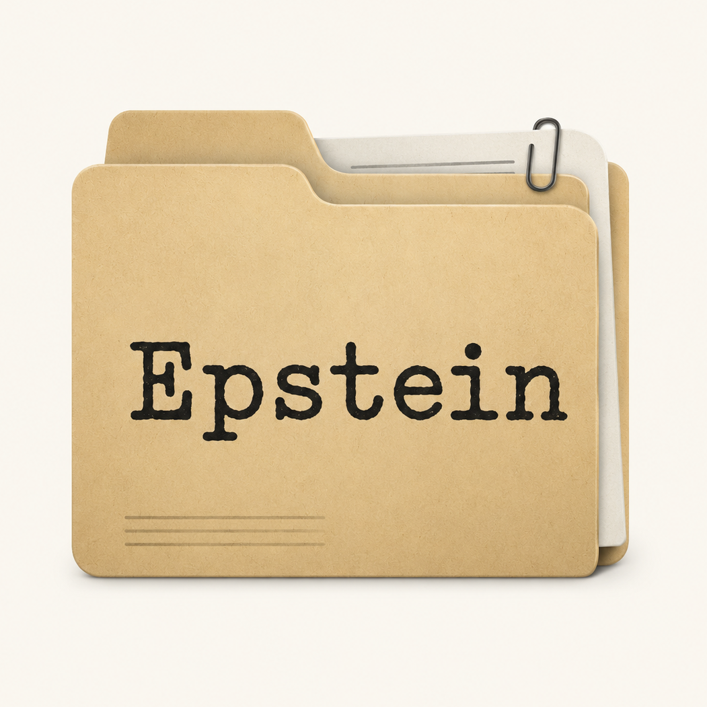
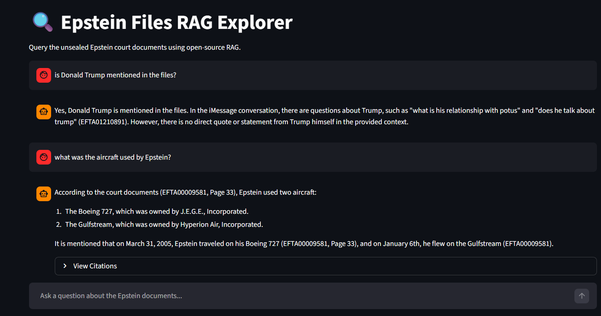

#  Epstein Files RAG Explorer 🔍

An open-source Retrieval-Augmented Generation (RAG) platform to explore and analyze the unsealed Jeffrey Epstein court documents. Built with LangChain, ChromaDB, and Streamlit.



## 🚀 Features
- **Open Stack**: Fully open-source tools and models.
- **Local & Fast**: Support for local execution via Ollama or high-speed cloud inference via Groq/OpenRouter.
- **Automated Ingestion**: Easily download and index curated parquet data from Hugging Face.
- **Strict Guardrails**: Designed to stay strictly within the context of the investigative documents.

---

## 🛠️ Setup Instructions

### Mac Studio / oMLX Quick Start
This fork is tuned for Apple Silicon and local oMLX:

```bash
scripts/setup_macos.sh
make doctor
make download
make index
make run
```

For the full dataset:

```bash
make download
make index
```

Or use the native helper:

```bash
EMBEDDING_DEVICE=auto scripts/index_full_native.sh
```

If you already have the full dataset elsewhere, link it during setup:

```bash
SOURCE_DATA_DIR=/path/to/data scripts/setup_macos.sh
```

The ingester is resumable. It records completed parquet files in
`chroma_db/ingest_manifest.json`, streams parquet row batches to keep memory
bounded, and uses stable chunk IDs. The full native helper also uses
`runtime/index_full.lock` so manual runs and LaunchAgent runs do not accidentally
start multiple full-index writers against the same Chroma database, and it
forwards stop signals to the child ingester before releasing the lock. Override
the lock path with `INDEX_LOCK_PATH` if you intentionally run an isolated
database.

To check progress without importing the ML stack:

```bash
.venv/bin/python ingest.py --status --check-hub
# or
scripts/status.sh
scripts/progress.sh
# Poll until indexing is complete, then run final validation:
make wait
```

`scripts/progress.sh` also reports manifest and index-log freshness. If an
active indexer has not written to `runtime/index_full.log` for more than
`INDEX_STALE_SECONDS` seconds, it prints a warning. Use
`scripts/progress.sh --json` for machine-readable monitor output. The JSON
payload includes small filename samples for downloaded files still missing from
the manifest and manifest entries whose parquet files are absent, so handoff
bundles can explain index/data mismatches without opening the manifest by hand.
The progress report also lists live `ingest.py` process IDs and warns if the
manifest says indexing is active but no indexer process is running. When process
scanning is unavailable, it still reports `runtime/index_full.lock` ownership
and whether the lock PID is alive. `make wait` treats stale progress signals as
failures so unattended runs do not loop forever after a stalled or orphaned
indexer.

To run a Mac readiness check:

```bash
scripts/doctor.sh
scripts/smoke_app.sh
scripts/validate_rag.sh
# Include a short oMLX generation call:
scripts/validate_rag.sh --rag
scripts/benchmark.sh
```

`scripts/doctor.sh` also checks free disk space on the Chroma volume. The
default minimum is `20` GB; override it with `MIN_FREE_DISK_GB` if your target
volume needs a different threshold.

To collect a timestamped handoff bundle with progress, audit gates, JSON audit
state, LaunchAgent status/validation, git state, a manifest, and index log tails:

```bash
make diagnostics
```

By default, diagnostics are written under `runtime/diagnostics/<timestamp>` and
`runtime/diagnostics/latest` points to the newest bundle. Each bundle includes
`manifest.json` with the source commit and file list. Machine-readable files
such as `progress.json` and `final_audit.json` are written as plain JSON.

The same commands are exposed as Make targets: `make status`, `make progress`,
`make wait`, `make validate`, `make validate-rag`, `make final-validate`,
`make benchmark`, `make test`, and `make check`.

This fork also includes `constraints-macos-arm64.txt`, a known-good constraints
set captured from the working Mac Studio environment. `scripts/setup_macos.sh`
uses it automatically when present.

The Streamlit config uses polling file watching on macOS to avoid FSEvents
startup failures seen in headless/local-service runs.

`make check` intentionally skips extra retrieval/benchmark passes while the full
indexer is actively writing to Chroma. Use `CHECK_DURING_INDEX=1 make check`
only when you explicitly want to stress concurrent read/write behavior.
Direct validation and benchmark commands also refuse to query Chroma while an
indexer is active. Pass `--allow-active-index` only when you intentionally want
to test concurrent read/write behavior.

Useful ingestion tuning knobs:

- `EMBEDDING_MODEL`: embedding model used for both ingestion and retrieval.
  Keep this unchanged after indexing unless you rebuild Chroma.
- `--row-batch-size`: parquet rows to stream at once.
- `--batch-size`: chunks to embed/write to Chroma at once.
- `--embedding-device mps`: request Apple Silicon acceleration for native runs.
  If PyTorch cannot initialize MPS on the current macOS/runtime, the app falls
  back to CPU automatically.
- `INDEX_LOG_PATH`, `INDEX_LOCK_PATH`, and `INDEX_STALE_SECONDS`: progress and
  unattended wait guardrails for the native full-index run.

Useful local generation knobs:

- `OMLX_MAX_TOKENS`: response cap for local oMLX calls.
- `OMLX_TIMEOUT_SECONDS`: request timeout for local oMLX calls.
- `LLM_TEMPERATURE`: shared temperature setting for all providers.
- `APP_ALLOW_QUERY_DURING_INDEX`: defaults to `0` so the Streamlit app pauses
  questions until the full Chroma index is complete. Set it to `1` only if you
  want to query the partial index during ingestion and accept possible Chroma
  read/write errors.

After the full corpus finishes indexing, run `make final-validate`. It fails
until all expected parquet files are indexed, then performs retrieval plus a
short oMLX generation check.

For a one-command completion gate, run `make final-audit`. It checks dataset
presence, full-index completion, native index-lock health, active index-progress
freshness, disk headroom, oMLX reachability, Docker asset integrity, LaunchAgent
template validity, Streamlit launch readiness, and final RAG validation. While indexing is still running, use
`scripts/final_audit.sh --allow-incomplete` to see the current gate state
without failing the command. Use `scripts/final_audit.sh --json` for
machine-readable gate output. Skipped gates are reported in `skipped_gates` and
never count as proof that the Mac conversion is complete.

For unattended completion, run `make wait`. It prints progress on an interval
and automatically runs the full final audit when the manifest shows all files
are indexed. It also removes a stale `runtime/index_full.lock` before the final
audit, which is useful if an older pre-lock indexer finished successfully. On
successful completion it writes a diagnostics bundle unless
`RUN_COMPLETION_DIAGNOSTICS=0` is set. Set `RUN_FINAL_AUDIT=0 make wait` to run
only the older final RAG validation path, or
`RUN_FINAL_AUDIT=0 RUN_FINAL_VALIDATE=0 make wait` to only wait and report
completion.

### Docker
The app can run in Docker Compose and connect back to host oMLX:

```bash
docker compose up --build
```

The compose file mounts `./data`, `./chroma_db`, and your host
`~/.omlx/settings.json` as a read-only secret. Containers do not get Apple MPS
acceleration, so native Mac execution is preferred for high-throughput
embedding/indexing.

The Docker image intentionally does not use `constraints-macos-arm64.txt` by
default because that file captures the native Mac Studio environment, not the
Linux container runtime. To force a constraint file for a custom build, pass
`--build-arg PIP_CONSTRAINT_FILE=<file>`.

The image and Compose service include a Streamlit HTTP health check on port
`8501`, so container runtimes can report when the app is actually serving.
`make final-audit` statically verifies the Dockerfile, Compose healthcheck,
host oMLX routing, mounted data/index paths, and `.dockerignore` exclusions even
on Macs where Docker is not installed.

### macOS LaunchAgent Templates
Example LaunchAgent plists live in `launchd/`:

- `com.epstein-rag.app.plist.example` starts the Streamlit app.
- `com.epstein-rag.indexer.plist.example` runs the full native indexer.

Copy a template into `~/Library/LaunchAgents/`, remove the `.example` suffix,
then load it with `launchctl bootstrap gui/$(id -u) ~/Library/LaunchAgents/<file>.plist`.
The templates use this checkout path:
`/Users/macstudio/Documents/RAG/Epstein_Files_RAG_macstudio`.

You can also install the app and indexer LaunchAgents from the current checkout:

```bash
make launchd-install
make launchd-status
make launchd-validate
```

Use `scripts/launchd_manage.sh install app` or `install indexer` to install
only one service. Use `scripts/launchd_manage.sh validate` to render and lint
the LaunchAgents without installing them. The helper renders the plist files
with the current checkout path and writes logs under `runtime/`.

### General Prerequisites
- **Python 3.10+** (Recommend using a virtual environment).
- **Ollama** (Optional): If you want to run LLMs completely locally. Download at [ollama.com](https://ollama.com/).

### General Installation
Clone the repository and install dependencies:
```bash
git clone https://github.com/aaramos/Epstein_Files_RAG
cd Epstein_Files_RAG

# Optional create a virtual environment
python -m venv venv
. venv/bin/activate

# install dependencies
pip install -r requirements.txt
```

### Environment Configuration
Copy the `.env.example` to `.env` and configure your providers:
```bash
cp .env.example .env
```
Fill in your API keys in `.env`:
- **Groq API**: Get yours at [console.groq.com](https://console.groq.com/).
- **OpenRouter API**: Get yours at [openrouter.ai](https://openrouter.ai/).
- **Ollama**: No key needed, just ensure it's running.

### Data Ingestion
The Epstein dataset is massive (>200GB). By default, the ingestion script downloads only the first **0.5 GB** chunk for testing.
```bash
python ingest.py
```
- **Estimated Time**: ~3-5 minutes for the first chunk (depending on your bandwidth).
- **Full Corpus**: Run `python ingest.py --all` or use `make download` and
  `make index`.

### Launch the Application
Start the Streamlit dashboard:
```bash
streamlit run app.py
# Mac/oMLX helper:
scripts/run_native.sh
```

---

## 📊 Dataset Info
- **Source**: [Nikity/Epstein-Files](https://huggingface.co/datasets/Nikity/Epstein-Files) on Hugging Face.
- **Format**: Apache Parquet files containing extracted text from investigative files.
- **Note**: The 0.5 GB limit (one parquet file) is used to ensure quick setup and low memory usage. The full dataset contains hundreds of thousands of documents.

## 🛡️ Guardrails
This application includes specialized system prompts to ensure the assistant stays strictly within the investigative context. It will refuse out-of-scope requests (like general knowledge or unrelated tasks) to maintain the integrity of the analysis.

## 📄 License
This project is licensed under the MIT License - see the [LICENSE](LICENSE) file for details.
